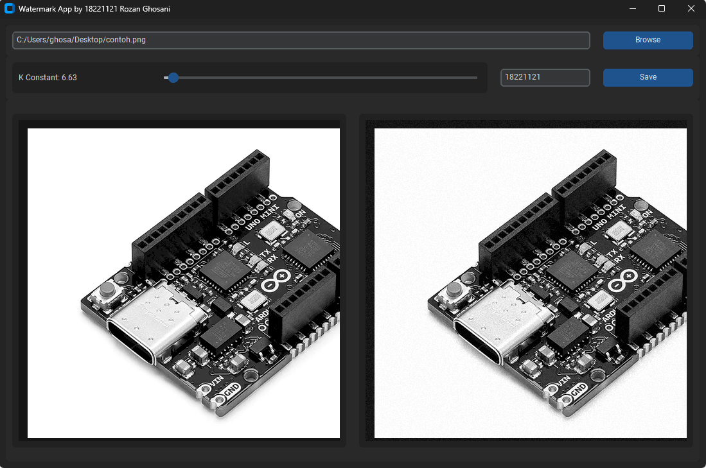

# Image Watermarking App



This application is an application that can be used to add watermarks to images using a spatial method with pseudorandom noise patterns. Use this application to add a watermark or authenticate your watermarked images

<center>
Made by Rozan Ghosani
</center>

## System Requirement

- Python v3.11.4 or later

### Module used

- Tkinter 
    
    ```pip install tkinter```
- Customtkinter 
    
    ```pip install customtkinter```
- CV2 
    
    ```pip install opencv-python```
- NumPy 

    ```pip install numpy```
- Pillow 

    ```pip install pillow```

## Installation

### Cloning repository

1. On the main page of the [Github Repository](https://github.com/zshnrg/WatermarkApp), open the **Clone** menu then copy the URL from the repository
2. Open Git Bash
3. Move to the desired directory
4. Type `git clone`, then paste the URL you copied earlier
    ```
    git clone https://github.com/zshnrg/WatermarkApp
5. Press **Enter** to create a *local clone*
   ```
   $ git clone https://github.com/zshnrg/WatermarkApp
    > Cloning into `WatermarkApp`...
    > remote: Counting objects: 10, done.
    > remote: Compressing objects: 100% (8/8), done.
    > remove: Total 10 (delta 1), reused 10 (delta 1)
    > Unpacking objects: 100% (10/10), done.
   ``` 

### Running the App
1. Open up `main_embeded.py` or `main_identifier.py`
2. Run the code using python

    ```
        python main_embeded.py

        or...

        python main_identifier.py
    ```

## Source
- [Pembubuhan Watermark Secara Spasial dengan Menggunakan Pseudorandom Noise Pattern](https://drive.google.com/file/d/1kNfujCqYPkXNQz5SO3sUJzShTtmjKgeX/view?usp=sharing)
- [Multimedia Systems Algorithms, Standards, and Industry Practices (Parag Havaldar, Gerard Medioni)](https://drive.google.com/file/d/1H_mySyf3Idthuxw-aF5DZLTtkduxJ6V_/view)